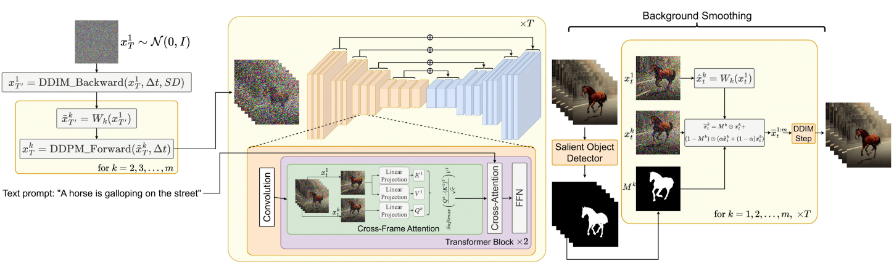
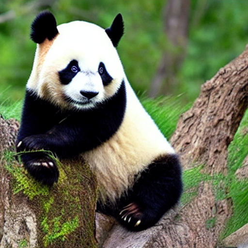
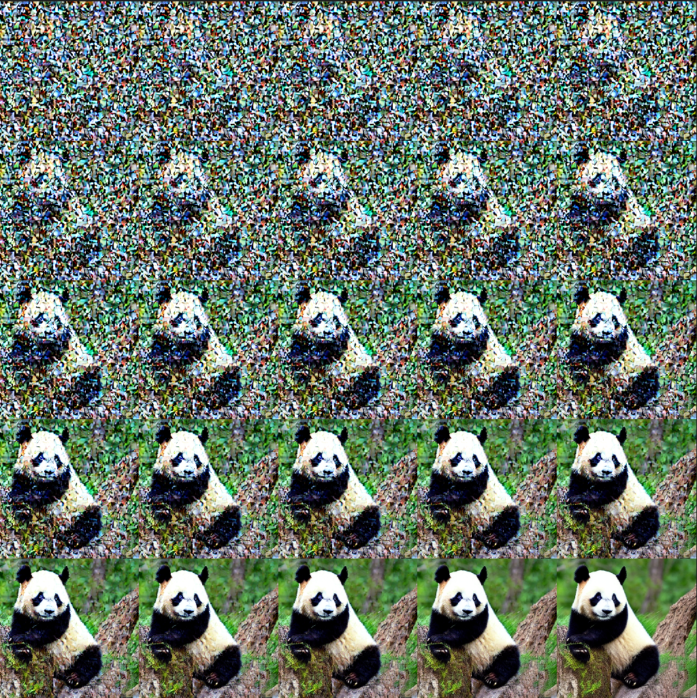

# Text2Video-Zero
Implementation of [Text2Video-Zero: Text-to-Image Diffusion Models are Zero-Shot Video Generators](https://arxiv.org/pdf/2303.13439.pdf)  




```shell
pip install diffusers transformers==4.26
# git lfs install
# git clone https://huggingface.co/runwayml/stable-diffusion-v1-5 --depth 1
```
