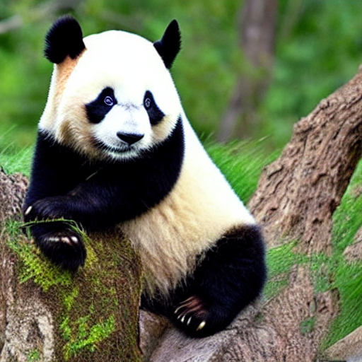
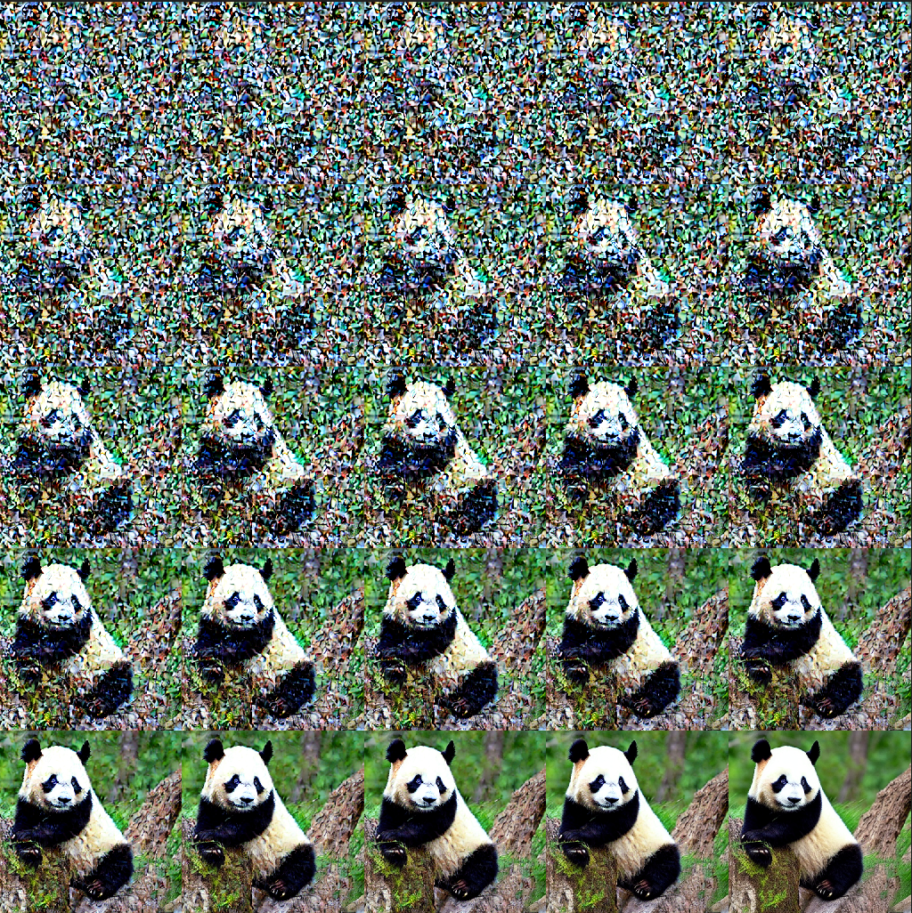
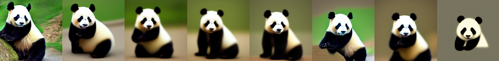
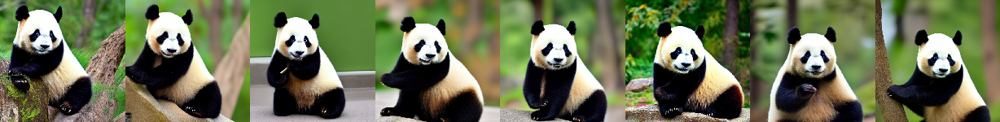
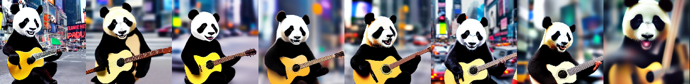
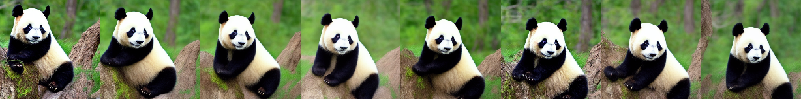
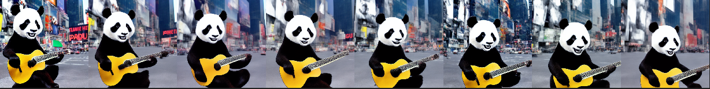
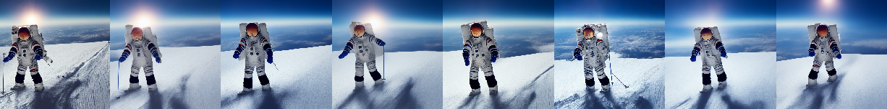

# Text2Video-Zero
Implementation of [Text2Video-Zero: Text-to-Image Diffusion Models are Zero-Shot Video Generators](https://arxiv.org/pdf/2303.13439.pdf)

```shell
pip install diffusers==0.14.0 transformers==4.26.0
# ControlNet
pip install git+https://github.com/patrickvonplaten/controlnet_aux.git
python generate.py
```



**Version 1**  


**Version 2** - Motion in Latents, No Cross-Frame Attention  



**Version 3** - Motion in Latents, Cross-Frame Attention  



